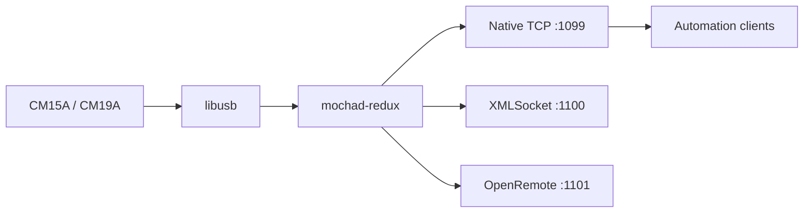

# mochad-redux

[](https://github.com/Monsterray/mochad-redux/actions/workflows/ci.yml)
[](https://github.com/Monsterray/mochad-redux/releases)
[](LICENSE.md)

A maintained Linux TCP gateway for X10 CM15A and CM19A controllers.

`mochad-redux` preserves the established mochad wire behavior while improving
build hygiene, diagnostics, safety, and long-term maintainability.

## Project Family

- **mochad-redux**: controller communication, USB, X10 encoding/decoding, TCP
  protocols, and native Linux installation.
- [mochad-docker](https://github.com/Monsterray/mochad-docker): Docker
  packaging and USB passthrough for this daemon.
- [mochad-mqtt-bridge](https://github.com/Monsterray/mochad-mqtt-bridge):
  MQTT transport, Home Assistant discovery, state inference, and device
  capabilities.

MQTT, Home Assistant behavior, and Docker runtime policy intentionally live in
the separate projects above.

## Highlights

- Backward-compatible native, XMLSocket, and OpenRemote TCP listeners.
- CM15A RF and power-line support plus CM19A RF support through libusb.
- Clear startup, listener, USB, client, and shutdown diagnostics.
- Read-only `hello`, `capabilities`, `health`, `clients`, `config`, `version`,
  and bounded `evidence` diagnostic commands.
- Validated configuration from defaults, file, environment, and CLI.
- A package-safe `make install` plus an explicit native setup tool.
- Strict compilation, sanitizers, static analysis, TCP regression tests, and
  documented hardware validation.

## Quick Start

### Native Linux

Install build dependencies on Debian or Ubuntu:

```sh
sudo apt update
sudo apt install build-essential autoconf automake libtool pkg-config \
  libusb-1.0-0-dev netcat-openbsd
```

Release archives include `configure`:

```sh
./configure
make
sudo make install
sudo mochad-redux-setup install --enable-now
```

The setup tool creates the `mochad` service identity, applies the `x10` USB
group policy, installs managed systemd and udev integration, and verifies the
result. Preview those host changes first with:

```sh
sudo mochad-redux-setup install --dry-run
```

### Git Checkout

Git checkouts generate the Autotools files first:

```sh
git clone https://github.com/Monsterray/mochad-redux.git
cd mochad-redux
./autogen.sh
./configure
make
sudo make install
sudo mochad-redux-setup install --enable-now
```

After startup, verify the main TCP listener:

```sh
printf 'hello\n' | nc localhost 1099
```

Pressing an X10 remote button should produce a line similar to:

```text
02/03 19:27:40 Rx RF HouseUnit: K4 Func: On
```

For package staging, `make DESTDIR="$PWD/stage" install` copies files only and
does not modify the host. See the
[rollback guide](docs/installation/native-install-rollback.md) for managed
native-install cleanup.

## Architecture



The main listener uses newline-delimited mochad events and commands. Port
`1100` is a legacy Flash XMLSocket-compatible listener that changes framing to
NUL-delimited data; it does not provide structured XML. Port `1101` preserves
the existing OpenRemote protocol. New integrations should use port `1099`.

Maintained source lives under `src/`, tests under `tests/`, Linux templates
under `packaging/`, maintenance tools under `scripts/`, and release evidence
under `validation/`. See the
[architecture guide](docs/architecture/architecture.md) and
[repository layout](docs/development/repository-layout-proposal.md).

## Requirements

- Linux with libusb 1.0.
- An X10 CM15A (`0bc7:0001`) or CM19A (`0bc7:0002`) controller.
- Permission to read and write the controller USB node.
- A C compiler and Autotools when building from source.
- `systemd` and `udev` for the recommended native integration path.

The earlier upstream line was tested on x86_64, aarch64, and armv6l Linux
systems. Current support expectations and evidence limits are tracked in
[supported platforms](docs/installation/supported-platforms.md).

## Common Configuration

Default listeners are:

| Service | Default | Purpose |
| --- | --- | --- |
| Main | `0.0.0.0:1099` | Native commands, events, and diagnostics |
| XMLSocket | `0.0.0.0:1100` | Legacy NUL-delimited compatibility |
| OpenRemote | `0.0.0.0:1101` | Legacy OpenRemote compatibility |

Configuration precedence is:

1. Compiled defaults.
2. Optional file from `MOCHAD_CONFIG` or `--config`.
3. Environment variables.
4. Command-line options.

Validate configuration without initializing USB:

```sh
mochad --check-config
mochad --print-config
```

IPv4 remains the default. Use `MOCHAD_BIND=::` or `--bind ::` to opt into
IPv6. Kernel or container policy can still prevent dual-stack operation.
Complete variables, listener switches, IPv6 behavior, diagnostics, and
troubleshooting are in the
[runtime configuration reference](docs/installation/runtime-configuration.md).

## Project Status

The maintained project version comes from [VERSION](VERSION); the upstream
baseline remains the separate identity `mochad 0.1.18`.

The current release line focuses on compatibility, validation, installation,
and repository stewardship. Source and CI evidence do not prove physical RF
delivery. CM15A and CM19A claims requiring real hardware are recorded
separately in release evidence.

Use tagged releases or exact full Git SHAs for testing. See
[beta status](docs/release/beta-status.md),
[compatibility](docs/architecture/compatibility.md), and
[release evidence](validation/README.md).

## Documentation

- [Documentation index](docs/README.md)
- [Native backup and isolated restore](docs/installation/backup-and-restore.md)
- [Design principles](docs/architecture/design.md)
- [Architecture](docs/architecture/architecture.md)
- [Runtime configuration](docs/installation/runtime-configuration.md)
- [Sanitized support bundles](docs/operations/support-bundles.md)
- [Native installation rollback](docs/installation/native-install-rollback.md)
- [Supported platforms](docs/installation/supported-platforms.md)
- [Hardware validation](docs/development/hardware-validation.md)
- [Maintainer guide](docs/development/maintaining.md)
- [Protocol documentation](docs/protocol/)
- [Source lineage](docs/research/source-lineage.md)
- [Security policy](SECURITY.md)

## Development and Testing

Run the smallest relevant validation first. Common source checks are:

```sh
scripts/validate/clean-build-test.sh --libusb-free-only
scripts/validate/unit-tests.sh
scripts/validate/tcp-diagnostics-smoke-test.sh
scripts/validate/version-consistency.sh
```

Additional focused checks include:

```sh
scripts/build/compile-without-libusb.sh --strict
scripts/validate/libusb-stub-syntax-check.sh
```

The libusb stub verifies ordinary USB-facing C syntax without hardware or real
libusb headers; it does not replace a Linux/libusb build. Sanitizers, distro
validation, source archives, and physical controller procedures are explicit
release gates described by the
[test strategy](docs/development/test-strategy.md).

Contributions should keep mechanical moves, formatting, behavior, tests, and
release changes separate. Do not add MQTT or named device-model semantics to
the daemon.

## Windows Development

`mochad-redux` is a Linux daemon. It depends on libusb-1.0, `poll()`,
`syslog`, `daemon()`, and termios, and it cannot be compiled or run natively
on Windows, with MSVC or with MinGW. Windows is an editing and
partial-testing environment only. Building, running, and the C unit tests
require WSL2 (or a real Linux host).

### Where Each Task Runs

| Task | Where |
| --- | --- |
| Edit code, `git` operations | Windows native |
| C build (`./autogen.sh && ./configure && make`) | WSL2 or Linux host |
| C unit tests | WSL2 or Linux host |
| Python tests (`pytest tests`) | Either, with reduced coverage on Windows (see below) |
| shellcheck | Either, after disabling CRLF conversion on Windows (see below) |
| Docker validation | WSL2 or Linux host |

### WSL2 Setup

WSL2 with Ubuntu 24.04 has no build toolchain on a bare install. Install one
with:

```sh
sudo apt update && sudo apt install -y build-essential autoconf automake libtool pkg-config libusb-1.0-0-dev shellcheck
```

### Cloning on Windows

Clone with CRLF conversion disabled:

```sh
git clone -c core.autocrlf=false https://github.com/Monsterray/mochad-redux.git
```

For an existing checkout:

```sh
git config core.autocrlf false
```

Otherwise Git rewrites the shell scripts under `scripts/` and `packaging/` to
CRLF line endings, and shellcheck reports thousands of spurious
`SC1017 literal carriage return` findings. Measured: 2255 spurious findings
on a CRLF checkout versus 22 real findings on a clean LF checkout.

### Python Tests on Windows

Running `python -m pytest tests` natively on Windows measured 4 passed, 17
failed. Every one of the 17 failures is a Windows platform artifact, not a
product bug:

- 15 of them subprocess-execute `scripts/backup/mochad-redux-backup`, which
  Windows cannot execute directly:
  `OSError: [WinError 193] %1 is not a valid Win32 application`.
- One creates a symlink and fails with
  `OSError: [WinError 1314] A required privilege is not held by the client`.
  Creating symlinks on Windows requires Developer Mode or an elevated shell;
  see the gotchas below.
- The last is a POSIX file-mode assertion that Windows does not honor:
  `AssertionError: 438 != 384` (`0o666` versus an expected `0o600`).

Effective Windows coverage of the backup/restore tooling is near zero: 16 of
its 20 tests cannot run, including the tests that cover credential exclusion
and root-restore refusal. Run the Python tests under WSL2 for real coverage
of that tooling.

Two other native-Windows mismatches affect test and script invocation:

- `python3` does not exist on Windows; the command is `python`. Anything
  that invokes `python3` fails with exit code 9009.
- Tests that call `bash -n` require `bash` on `PATH`; without it they fail
  with exit code 127. Git Bash provides it.
- Creating symlinks requires elevated privileges. Enable Developer Mode
  (Settings, System, For developers) or run from an elevated shell, otherwise
  symlink operations fail with
  `OSError: [WinError 1314] A required privilege is not held by the client`.

### Linting on Windows

`scripts/backup/mochad-redux-backup` is a Python script with no `.py`
extension. `ruff` and `bandit` silently skip it unless pointed at it
explicitly, and `shellcheck` refuses it (`SC1071`). The same applies to
`packaging/openwrt/hotplug2/20-usb-x10` and
`packaging/openwrt/init.d/mochad` (both `#!/bin/sh`). Point linters at these
paths by name, or they get zero coverage.

A venv runs `ruff`, `bandit`, and the Python tests natively:

```sh
python -m venv .venv
.venv\Scripts\python -m pip install pytest ruff bandit shellcheck-py
```

### Summary

Editing, `git`, reading code, and running the passing subset of the
pure-Python test files all work natively on Windows. Compiling, running the
daemon, the C unit tests, and full backup/restore test coverage require
WSL2 or a real Linux host.

## Related Projects

- [mochad-docker](https://github.com/Monsterray/mochad-docker)
- [mochad-mqtt-bridge](https://github.com/Monsterray/mochad-mqtt-bridge)
- [linuxha/mochad](https://github.com/linuxha/mochad)
- [sigmdel/mochad](https://github.com/sigmdel/mochad)
- [Upstream SourceForge releases](https://sourceforge.net/projects/mochad/files/)

Historical references are preserved in
[source lineage](docs/research/source-lineage.md) rather than serving as
current installation guidance.

## Contributing

Read [CONTRIBUTING.md](CONTRIBUTING.md) before opening a change. Bug reports
should include the exact version or SHA, operating system and architecture,
controller VID:PID, installation method, sanitized logs, and rollback result.

## License

GNU General Public License version 3.0 or later (`GPL-3.0-or-later`). See
[LICENSE.md](LICENSE.md), [COPYING](COPYING), [NOTICE](NOTICE), and
[source lineage](docs/research/source-lineage.md).
