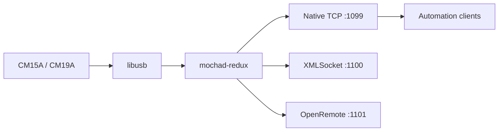

# mochad-redux

[](https://github.com/Monsterray/mochad-redux/actions/workflows/ci.yml)
[](https://github.com/Monsterray/mochad-redux/releases)
[](LICENSE.md)

A maintained Linux TCP gateway for X10 CM15A and CM19A controllers.

`mochad-redux` preserves the established mochad wire behavior while improving
build hygiene, diagnostics, safety, and long-term maintainability.

## Project Family

- **mochad-redux**: controller communication, USB, X10 encoding/decoding, TCP
  protocols, and native Linux installation.
- [mochad-docker](https://github.com/Monsterray/mochad-docker): Docker
  packaging and USB passthrough for this daemon.
- [mochad-mqtt-bridge](https://github.com/Monsterray/mochad-mqtt-bridge):
  MQTT transport, Home Assistant discovery, state inference, and device
  capabilities.

MQTT, Home Assistant behavior, and Docker runtime policy intentionally live in
the separate projects above.

## Highlights

- Backward-compatible native, XMLSocket, and OpenRemote TCP listeners.
- CM15A RF and power-line support plus CM19A RF support through libusb.
- Clear startup, listener, USB, client, and shutdown diagnostics.
- Read-only `hello`, `capabilities`, `health`, `clients`, `config`, `version`,
  and bounded `evidence` diagnostic commands.
- Validated configuration from defaults, file, environment, and CLI.
- A package-safe `make install` plus an explicit native setup tool.
- Strict compilation, sanitizers, static analysis, TCP regression tests, and
  documented hardware validation.

## Quick Start

### Native Linux

Install build dependencies on Debian or Ubuntu:

```sh
sudo apt update
sudo apt install build-essential autoconf automake libtool pkg-config \
  libusb-1.0-0-dev netcat-openbsd
```

Release archives include `configure`:

```sh
./configure
make
sudo make install
sudo mochad-redux-setup install --enable-now
```

The setup tool creates the `mochad` service identity, applies the `x10` USB
group policy, installs managed systemd and udev integration, and verifies the
result. Preview those host changes first with:

```sh
sudo mochad-redux-setup install --dry-run
```

### Git Checkout

Git checkouts generate the Autotools files first:

```sh
git clone https://github.com/Monsterray/mochad-redux.git
cd mochad-redux
./autogen.sh
./configure
make
sudo make install
sudo mochad-redux-setup install --enable-now
```

After startup, verify the main TCP listener:

```sh
printf 'hello\n' | nc localhost 1099
```

Pressing an X10 remote button should produce a line similar to:

```text
02/03 19:27:40 Rx RF HouseUnit: K4 Func: On
```

For package staging, `make DESTDIR="$PWD/stage" install` copies files only and
does not modify the host. See the
[rollback guide](docs/installation/native-install-rollback.md) for managed
native-install cleanup.

## Architecture



The main listener uses newline-delimited mochad events and commands. Port
`1100` is a legacy Flash XMLSocket-compatible listener that changes framing to
NUL-delimited data; it does not provide structured XML. Port `1101` preserves
the existing OpenRemote protocol. New integrations should use port `1099`.

Maintained source lives under `src/`, tests under `tests/`, Linux templates
under `packaging/`, maintenance tools under `scripts/`, and release evidence
under `validation/`. See the
[architecture guide](docs/architecture/architecture.md) and
[repository layout](docs/development/repository-layout-proposal.md).

## Requirements

- Linux with libusb 1.0.
- An X10 CM15A (`0bc7:0001`) or CM19A (`0bc7:0002`) controller.
- Permission to read and write the controller USB node.
- A C compiler and Autotools when building from source.
- `systemd` and `udev` for the recommended native integration path.

The earlier upstream line was tested on x86_64, aarch64, and armv6l Linux
systems. Current support expectations and evidence limits are tracked in
[supported platforms](docs/installation/supported-platforms.md).

## Common Configuration

Default listeners are:

| Service | Default | Purpose |
| --- | --- | --- |
| Main | `0.0.0.0:1099` | Native commands, events, and diagnostics |
| XMLSocket | `0.0.0.0:1100` | Legacy NUL-delimited compatibility |
| OpenRemote | `0.0.0.0:1101` | Legacy OpenRemote compatibility |

Configuration precedence is:

1. Compiled defaults.
2. Optional file from `MOCHAD_CONFIG` or `--config`.
3. Environment variables.
4. Command-line options.

Validate configuration without initializing USB:

```sh
mochad --check-config
mochad --print-config
```

IPv4 remains the default. Use `MOCHAD_BIND=::` or `--bind ::` to opt into
IPv6. Kernel or container policy can still prevent dual-stack operation.
Complete variables, listener switches, IPv6 behavior, diagnostics, and
troubleshooting are in the
[runtime configuration reference](docs/installation/runtime-configuration.md).

## Project Status

The maintained project version comes from [VERSION](VERSION); the upstream
baseline remains the separate identity `mochad 0.1.18`.

The current release line focuses on compatibility, validation, installation,
and repository stewardship. Source and CI evidence do not prove physical RF
delivery. CM15A and CM19A claims requiring real hardware are recorded
separately in release evidence.

Use tagged releases or exact full Git SHAs for testing. See
[beta status](docs/release/beta-status.md),
[compatibility](docs/architecture/compatibility.md), and
[release evidence](validation/README.md).

## Documentation

- [Documentation index](docs/README.md)
- [Native backup and isolated restore](docs/installation/backup-and-restore.md)
- [Design principles](docs/architecture/design.md)
- [Architecture](docs/architecture/architecture.md)
- [Runtime configuration](docs/installation/runtime-configuration.md)
- [Sanitized support bundles](docs/operations/support-bundles.md)
- [Native installation rollback](docs/installation/native-install-rollback.md)
- [Supported platforms](docs/installation/supported-platforms.md)
- [Hardware validation](docs/development/hardware-validation.md)
- [Maintainer guide](docs/development/maintaining.md)
- [Protocol documentation](docs/protocol/)
- [Source lineage](docs/research/source-lineage.md)
- [Security policy](SECURITY.md)

## Development and Testing

Run the smallest relevant validation first. Common source checks are:

```sh
scripts/validate/clean-build-test.sh --libusb-free-only
scripts/validate/unit-tests.sh
scripts/validate/tcp-diagnostics-smoke-test.sh
scripts/validate/version-consistency.sh
```

Additional focused checks include:

```sh
scripts/build/compile-without-libusb.sh --strict
scripts/validate/libusb-stub-syntax-check.sh
```

The libusb stub verifies ordinary USB-facing C syntax without hardware or real
libusb headers; it does not replace a Linux/libusb build. Sanitizers, distro
validation, source archives, and physical controller procedures are explicit
release gates described by the
[test strategy](docs/development/test-strategy.md).

Contributions should keep mechanical moves, formatting, behavior, tests, and
release changes separate. Do not add MQTT or named device-model semantics to
the daemon.

## Windows Development

`mochad-redux` targets POSIX systems. **It does not currently compile on Windows** — not with MSVC,
not with MinGW. Edit on Windows, build and test in WSL2.

The obstacle is not USB access: `libusb-1.0` is itself cross-platform. What is POSIX-only is the
surrounding runtime — `syslog`/`openlog` for logging, `daemon()` for backgrounding, and the
`poll()`/`sys/socket.h`/`unistd.h` service layer. Porting to Windows would mean a compatibility shim
for those three areas (Windows offers `WSAPoll`, services instead of `daemon()`, and its own event
log), not a rewrite of the X10 or USB logic. macOS is a much smaller gap, since all three exist
there natively; it is simply untested and unsupported today.

### Minimum setup

Two commands. WSL2 with Ubuntu is assumed — `wsl --install` if you don't have it.

**1. Install the toolchain** (`-u root` avoids needing your WSL password):

```powershell
wsl -u root -- apt-get update
wsl -u root -- apt-get install -y build-essential autoconf automake libtool pkg-config libusb-1.0-0-dev shellcheck
```

**2. Clone with CRLF conversion off** — not optional, see below:

```powershell
git clone -c core.autocrlf=false https://github.com/Monsterray/mochad-redux.git
```

### Build and test

```powershell
wsl -- bash -c "./autogen.sh && ./configure && make && bash scripts/validate/unit-tests.sh"
```

That produces a green run: 7 C unit binaries, plus 21 Python tests covering backup/restore and
support bundles.

> [!IMPORTANT]
> **Always clone with `core.autocrlf=false`.** Git otherwise rewrites every shell script to CRLF,
> which breaks them under Linux and makes shellcheck emit thousands of phantom
> `SC1017 literal carriage return` errors — measured 2255 spurious versus 23 real.
>
> Already cloned the wrong way? `git config` alone does not rewrite the working tree:
> ```bash
> git config core.autocrlf false && git rm --cached -r . && git reset --hard
> ```

<details>
<summary><b>Running the Python tests natively on Windows (optional, reduced coverage)</b></summary>

<br>

```powershell
python -m venv .venv
.venv\Scripts\python -m pip install pytest ruff bandit shellcheck-py
.venv\Scripts\python -m pytest tests
```

Expect **4 passed, 17 failed**. All 17 failures are Windows platform artifacts, not product bugs:

| Count | Cause |
| --- | --- |
| 15 | Tests subprocess-execute `scripts/backup/mochad-redux-backup`; Windows cannot run it directly — `WinError 193` |
| 1 | Symlink creation without privilege — `WinError 1314`. Needs Developer Mode (Settings → System → For developers) |
| 1 | POSIX file-mode assertion — `438 != 384` (`0o666` vs `0o600`). Windows has no POSIX permission bits |

Because 16 of the backup tool's 20 tests cannot run here, native Windows gives **near-zero coverage
of the backup/restore tooling** — including the credential-exclusion and root-restore-refusal tests.
Those all pass under WSL2. Use WSL for anything you intend to trust.

</details>

<details>
<summary><b>Gotchas and troubleshooting</b></summary>

<br>

- **`python3` does not exist on Windows** — the command is `python`. Anything invoking `python3` exits `9009`.
- **Keep `bash` on PATH** (Git Bash) or tests calling `bash -n` exit `127`.
- **Set `PYTHONUTF8=1`** — the console is cp1252/IBM437 and printing any non-ASCII character raises
  `UnicodeEncodeError`. Persist it with
  `[Environment]::SetEnvironmentVariable('PYTHONUTF8','1','User')`, then open a new terminal.
- **Never "fix" a POSIX file-mode failure on Windows.** The assertion is correct; the platform is wrong.
- **Linting misses `scripts/backup/mochad-redux-backup`** — it is Python with no `.py` extension, so
  `ruff` and `bandit` skip it silently and `shellcheck` refuses it (`SC1071`). Point tools at it
  explicitly. Same for `packaging/openwrt/hotplug2/20-usb-x10` and `packaging/openwrt/init.d/mochad`.
- Building under `/mnt/c` works but is slow; for heavy C work clone inside the WSL filesystem instead.

| Symptom | Fix |
| --- | --- |
| `UnicodeEncodeError: 'charmap' codec` | Set `PYTHONUTF8=1` |
| `exit code 9009` | Something called `python3`; use `python` |
| `exit code 127` | `bash` not on PATH |
| `WinError 193` | Executing a `.sh` directly — expected, run it in WSL |
| `WinError 1314` | Enable Developer Mode |
| `assert 438 == 384` | Expected on Windows; do not "fix" |

</details>

### Where each task runs

| Task | Windows | WSL2 / Linux |
| --- | --- | --- |
| Edit code, `git` | Yes | Yes |
| C build and C unit tests | **No** | Yes |
| Python tests | Partial — 4 of 21 | Yes, all pass |
| shellcheck | Yes (`shellcheck-py`) | Yes |
| USB / CM15A hardware validation | No | Linux host or Pi only |

## Related Projects

- [mochad-docker](https://github.com/Monsterray/mochad-docker)
- [mochad-mqtt-bridge](https://github.com/Monsterray/mochad-mqtt-bridge)
- [linuxha/mochad](https://github.com/linuxha/mochad)
- [sigmdel/mochad](https://github.com/sigmdel/mochad)
- [Upstream SourceForge releases](https://sourceforge.net/projects/mochad/files/)

Historical references are preserved in
[source lineage](docs/research/source-lineage.md) rather than serving as
current installation guidance.

## Contributing

Read [CONTRIBUTING.md](CONTRIBUTING.md) before opening a change. Bug reports
should include the exact version or SHA, operating system and architecture,
controller VID:PID, installation method, sanitized logs, and rollback result.

## License

GNU General Public License version 3.0 or later (`GPL-3.0-or-later`). See
[LICENSE.md](LICENSE.md), [COPYING](COPYING), [NOTICE](NOTICE), and
[source lineage](docs/research/source-lineage.md).
